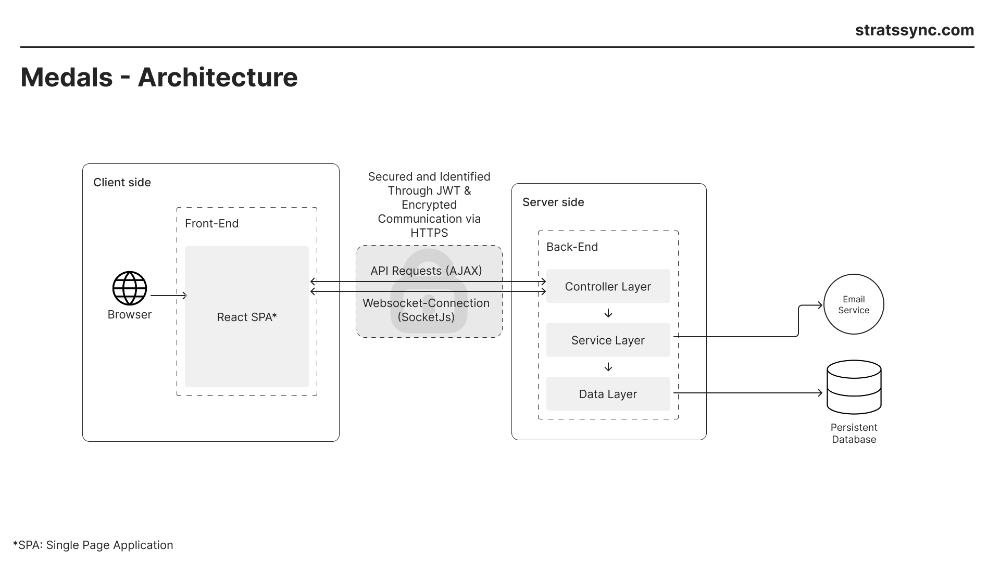

<p align="center">
    <a href="https://stratssync.com">
        <picture>
            
        </picture>
    </a>
</p>

<p align="center">Train smarter. Track better. Win medals.</p>

<p align="center">
  <a href="https://opensource.org/licenses/BSD-3-Clause">
    
  </a>
  
  <a href="https://stratssync.com">
    
  </a>
</p>

<p align="center">
    <b>Medals-Deployment</b> - the deployment for <a href="https://stratssync.com">Medals</a>.
</p>

This project contains all files needed to deploy the official version of Medals as well as everything needed to deploy it locally yourself or on your own server.

## Table of contents

- [What is Medals](#Medals)
- [Local Deployment](#local-deployment)
- [Custom Deployment](#custom-deployment)
  - [Frontend Image](#frontend-image)
  - [deploy.env](#deployenv)
  - [Configuration](#configuration)
- [Architecture](#architecture)

## Medals

Medals is an application to administer athletes for the [Deutsche Sportabzeichen](https://deutsches-sportabzeichen.de/).
Trainers can administer their athletes, track the performances for different disciplines, add/remove swimming
certificates, see wether the athlete is eligible to receive a
[Deutsche Sportabzeichen](https://deutsches-sportabzeichen.de/). Athletes can see their own performances, wether
they have a valid swimming
certificate and if they are eligible for a [Deutsche Sportabzeichen](https://deutsches-sportabzeichen.de/), if not
what they need to do to be eligible.

## Local Deployment

To deploy a version of Medals locally you only need to have docker installed and execute `installation.sh`.

The script will ask you for some information, create a deploy.env file for you and start the docker compose.

## Custom Deployment

This section contains all information needed to configure everything needed to make your own deployment of medals.

### Frontend Image

The frontend has to know the url of your backend. Information on how to create your custom frontend image is in the [Medals-Frontend](https://github.com/Magenta-Mause/Medals-Frontend) documentation.

You need to change the image used from the `frontend` container in the `compose.yaml` file to the image created by you.

### deploy.env

You will need to create a `deploy.env` file. See the following reference for help:

    POSTGRES_USER                         The user of the Postgres Database
    POSTGRES_PASSWORD                     The password to the Postgres Database.
                                          Can only consist of lower case letters and numbers
    POSTGRES_DB                           The name of the Postgres Database
    JWS_SECRET                            The JWT Secret. Can only consist of lower case letters
                                          and numbers. You can generate the secret using the
                                          following website: https://jwtsecret.com/generate
    EMAIL_ENDPOINT                        This endpoint will be used to send email for Medals
    EMAIL_AUTHOR                          This is the author of all medals sent by Medals
    APP_ADMIN_ADMINS_0_EMAIL              Enter your email address here
    APP_ADMIN_ADMINS_0_FIRST              Enter the first name of your admin account here
    APP_ADMIN_ADMINS_0_LAST               Enter the last name of your admin account here

### Configuration

---

The repository contains different scripts you can use to add more functionality to your Medals deployment.

#### Backup

---

To create a backup of the database you need to execute the `dbBackup.sh` script inside the `postgres_db` container.
To do that execute the following command: `docker compose exec postgres_db bash ./scripts/dbBackup.sh`

#### Logs

---

The `./scripts` directory additionally contains the scripts `log_purge_before.sh` and `log_purge_current.sh`. These scripts can be used to
remove docker logs, ensuring compliance with any privacy regulations applying to you as an administrator:

##### `log_purge_before.sh`

This script purges all logs from a docker container before a specified timestamp. You can run it as follows:

```bash
./log_purge_before.sh [container_id] [timestamp]
```

The timestamp is in the format `YYYY-MM-DDTHH:MM:SS.nsZ` (e.g. `2025-04-11T10:03:56.605310101Z`). Please note that this script requires
the permissions to read and delete log files in the `/var/lib/docker/containers` directory.

The `[container_id]` needs to be the **full** container hash.

##### `log_purge_current.sh`

This script, similarly to `log_purge_before.sh`, purges log messages for compliance. It is a little shortcut to purge the current logfile
of a container which makes it suitable for use in a cronjob:

```bash
./log_purge_current.sh [container_id]
```

##### `log_purge_deployment.sh`

This script eases getting the container ids by automatically detecting
all containers running in the project `medals-deployment`, and purging
their logs.

## Architecture

# [](https://stratssync.com/)

## Deployment Process

TODO

## Infrastructure

The [Medals-Frontend](https://github.com/magenta-Mause/Medals-Frontend/) and [Medals-Backend](https://github.com/magenta-Mause/Medals-Backend/) generate an docker image on every commit to main
or if the publish-image workflow is manually executed. The image is published to docker hub under the
ecofreshkaese namespace -> ecofreshkaese/medals-frontend and ecofreshkaese/medals-backend respectively.

The frontend image uses a nginx-base-image to serve the frontend. A base nginx config file is provided but gets overwritten for the final
deployment. While building the image multiple environment variables can be set to e.g. configure the backend base url.

The backend image uses a java-base-image and runs the spring boot application.

The images are orchestrated with docker-compose.

An Open Telekom Cloud (OTC) server is used for the deployment.

## Deployment

On the OTC server two systemd services are used to deploy the application. The medals-deployment.service gets started on each server start, pulls the newest backend and frontend images and executed the deployment docker-compose file.

When the publish workflow gets executed on the backend and frontend projects, after the images are published to the ecofreshkaese namespace, the medals-deployment.service gets restarted via ssh in the workflow to automatically deploy the services.

The second systemd service is the medals-get-deployment.service that pulls the newest changes from the main branch of this project in the deployment dir and restarts the docker-compose. Commits to the main branch of this project restart this service to deploy the newest changes.

The application internally runs on port 1024, which gets exposed to port 80 (https) and 443 (https) via an extra nginx deployment that enables https support for the application with the help of certbot.
